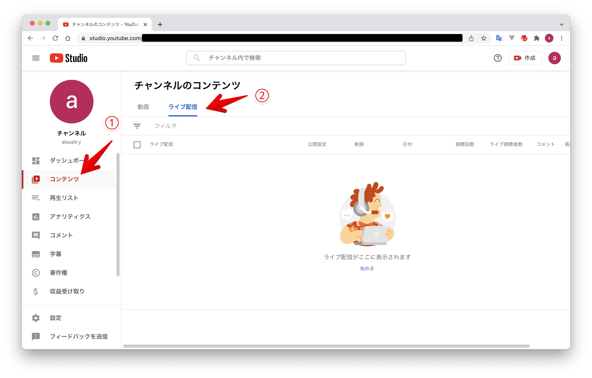
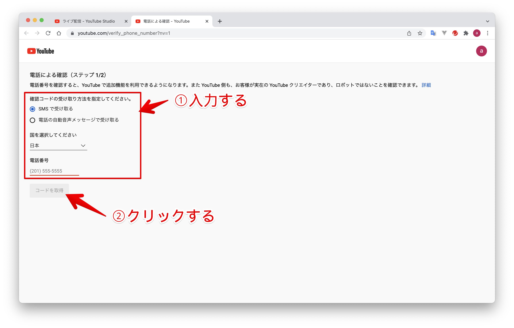
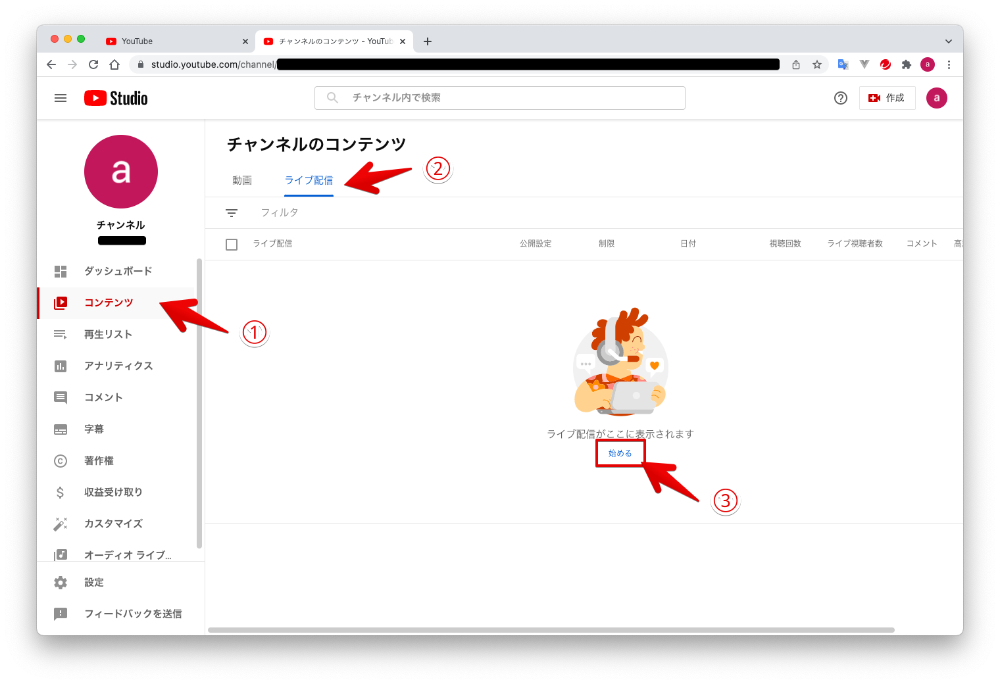

# Youtubeでライブ配信する

目次
<!-- TOC -->

- [Youtubeでライブ配信する](#youtubeでライブ配信する)
    - [はじめに](#はじめに)
    - [必要なもの](#必要なもの)
    - [ライブ配信を行う準備](#ライブ配信を行う準備)
        - [Googleアカウントを用意する](#googleアカウントを用意する)
        - [自分のYoutubeチャンネルのライブ配信を有効にする](#自分のyoutubeチャンネルのライブ配信を有効にする)
    - [ライブ配信をすぐに始める](#ライブ配信をすぐに始める)
            - [詳細](#詳細)
            - [カスタマイズ](#カスタマイズ)
            - [公開設定](#公開設定)
        - [ライブ配信中にライブ配信URLを取得する](#ライブ配信中にライブ配信urlを取得する)
        - [ライブ配信を終了する。](#ライブ配信を終了する)

<!-- /TOC -->

## はじめに

Youtubeでライブ配信を行う手順を説明します。  
ライブ配信する内容は以下の3点です。

* ノートPCのカメラ映像
* ノートPCのデスクトップ画面
* ノートPCのマイク音声

## 必要なもの

* カメラ・マイク内蔵ノートPC
* Googleアカウント
* 24時間以上の準備時間  
  自分のチャンネルでライブ配信機能を有効に設定してからGoogle側が許可するまで24時間かかります。
* エンコーダーソフト  
  デスクトップ画面をライブ配信するために必要。  
  今回は「OBS Studio」を使用します。  
  カメラの映像のみ配信する場合は不要です。

## ライブ配信を行う準備

### Googleアカウントを用意する

Googleを使っていればそのアカウントを使えます。  
Googleアカウントを持っていない場合は新たに作成してください。

### 自分のYoutubeチャンネルのライブ配信を有効にする

ブラウザでYoutubeを開き、自分のGoogleアカウントにログインします。  
左側のメニューから「自分の動画」をクリックしてYoutube Studioを表示します。

Youtube Studioで [コンテンツ]-[ライブ配信]タブをクリックし、「始める」をクリックします。

「ライブ配信は現在ご利用いただけません」と表示されたら、「有効にする」をクリックします。

「パソコンでライブ配信機能にアクセスするには、まず電話番号を確認してください」と表示されたら「確認」をクリックします。

電話による確認の画面で、確認コードの受け取り方法と電話番号を入力します。  
入力後、「コードを取得」をクリックします。

携帯電話に確認コードが送られてくるので、確認コードを入力して「送信」をクリックします。

「電話番号を確認しました」が表示されたら、この画面を閉じます。

「ライブ配信」の画面にはライブ配信用のアカウントが有効になるまで24時間かかる旨のメッセージが表示されるので、続きは24時間後に行います。

## ライブ配信をすぐに始める

PC内蔵カメラとマイクの内容をライブ配信する場合は、ブラウザからすぐに始められます。

Youtubeのページから [自分の動画] - [コンテンツ] - [ライブ配信]の順にクリックし、「始める」をクリックします。

「Youtubeライブ管理画面にようこそ」と表示されるので、「今すぐ」枠の「開始」をクリックします。

「内蔵ウェブカメラ」枠の「選択」をクリックします。

「配信の作成」画面で配信の設定をします。  
設定は以下の3ステップです。

* 詳細
* カスタマイズ
* 公開設定

#### 詳細

「詳細」ステップでは、配信する内容に合わせて設定します。  
必須項目は「タイトル」と「視聴者」（子供向けかどうかを設定）なので、最低限これだけ入力すればOKです。  
必要な項目を設定して、「次へ」をクリックします。

#### カスタマイズ

ライブ配信中のチャットの設定を行います。  
お好みの設定にして、「次へ」をクリックします。

#### 公開設定

視聴できるユーザを指定します。  
限定公開は、ライブ配信のURLを知っているユーザのみ視聴できます。  
ライブ配信のURLは配信中にコピーすることができます。

今回は限定公開にします。限定公開を選択して「次へ」をクリックします。

「ストリームのプレビュー」画面が表示されます。
ライブ配信するカメラとマイクを選択します。  
「ライブ配信を開始」をクリックするとライブ配信が始まります。

ライブ配信が始まりました。

### ライブ配信中にライブ配信URLを取得する

ライブ配信画面の共有矢印アイコンをクリックすると、「ライブ配信の共有」画面が表示され、動画リンクのURLをコピーできます。

「動画リンク」に表示されているURLをライブ配信を見せたい人に共有します。

### ライブ配信を終了する。

「ライブ配信を終了」をクリックすると、ライブ配信を終了します。

「ストリーム完了」画面で「閉じる」をクリックします。

Youtube Studioの[コンテンツ]-[ライブ配信]をクリックすると、ライブ配信した動画が保存されています。  
ライブ配信した動画を再生したり、動画のURLを共有して他の人と動画を共有できます。

