# Youtubeライブ配信チュートリアル

目次
<!-- TOC -->

- [Youtubeライブ配信チュートリアル](#youtubeライブ配信チュートリアル)
    - [はじめに](#はじめに)
        - [本手順の目的](#本手順の目的)
        - [本手順でライブ配信できる内容](#本手順でライブ配信できる内容)
        - [注意事項](#注意事項)
    - [必要なもの](#必要なもの)
    - [ライブ配信を行う準備](#ライブ配信を行う準備)
        - [Googleアカウントを用意する](#googleアカウントを用意する)
        - [自分のYoutubeチャンネルのライブ配信を有効にする](#自分のyoutubeチャンネルのライブ配信を有効にする)
    - [ライブ配信をすぐに始める](#ライブ配信をすぐに始める)
        - [ライブ配信を始める](#ライブ配信を始める)
            - [詳細](#詳細)
            - [カスタマイズ](#カスタマイズ)
            - [公開設定](#公開設定)
        - [ライブ配信中にライブ配信URLを取得する](#ライブ配信中にライブ配信urlを取得する)
        - [ライブ配信を終了する。](#ライブ配信を終了する)
    - [ライブ配信を事前にスケジューリングする](#ライブ配信を事前にスケジューリングする)
        - [配信予定のライブ配信を作成する](#配信予定のライブ配信を作成する)
            - [詳細](#詳細)
            - [カスタマイズ](#カスタマイズ)
            - [公開設定](#公開設定)
        - [配信予定のライブ配信を確認する](#配信予定のライブ配信を確認する)
            - [Youtube Studioで確認する](#youtube-studioで確認する)
            - [視聴者にどう見えるか確認する](#視聴者にどう見えるか確認する)
        - [配信予定のライブ配信を編集する](#配信予定のライブ配信を編集する)
            - [ライブ配信開始前に表示するサムネイルを変更する](#ライブ配信開始前に表示するサムネイルを変更する)
        - [視聴者にライブ配信URLを伝える](#視聴者にライブ配信urlを伝える)
        - [配信予定のライブ配信を開始する](#配信予定のライブ配信を開始する)

<!-- /TOC -->

## はじめに

### 本手順の目的

本手順の目的は以下の2点です。

- Youtubeライブ配信を経験する。
- 実際にライブ配信を行う際に手順を確認する。

まずは本手順に従って実際に操作し、Youtubeライブ配信を経験してみてください。

### 本手順でライブ配信できる内容

ライブ配信する内容は以下の2点です。

* ノートPCのカメラ映像
* ノートPCのマイク音声

### 注意事項

本手順は2022年2月に作成しました。

Youtubeの画面構成は日々改善されています。
日が経つにつれ、本手順書に記載した手順・画像から変更となる可能性がありますので、あらかじめご承知おきください。

## 必要なもの

* カメラ・マイク内蔵ノートPC
* Googleアカウント
* 24時間以上の準備時間  
  自分のチャンネルでライブ配信機能を有効に設定してからGoogle側が許可するまで24時間かかります。

## ライブ配信を行う準備

### Googleアカウントを用意する

既にGoogleを持っていればそのアカウントを使えます。  
Googleアカウントを持っていない場合は新たに作成してください。

### 自分のYoutubeチャンネルのライブ配信を有効にする

ブラウザでYoutubeを開き、自分のGoogleアカウントにログインします。  
左側のメニューから「自分の動画」をクリックしてYoutube Studioを表示します。

Youtube Studioで [コンテンツ]-[ライブ配信]タブをクリックし、「始める」をクリックします。

「ライブ配信は現在ご利用いただけません」と表示されたら、「有効にする」をクリックします。
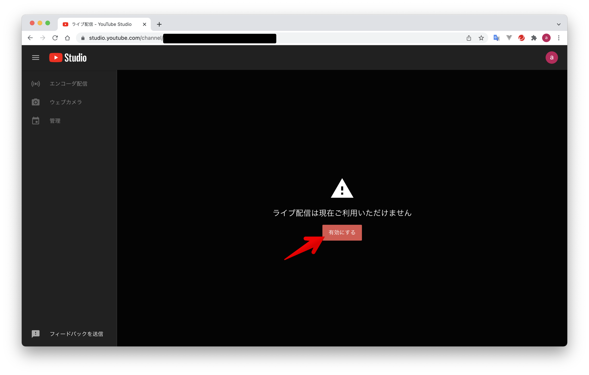

「パソコンでライブ配信機能にアクセスするには、まず電話番号を確認してください」と表示されたら「確認」をクリックします。

電話による確認の画面で、確認コードの受け取り方法と電話番号を入力します。  
入力後、「コードを取得」をクリックします。

確認コードが通知されたら、確認コードを入力して「送信」をクリックします。
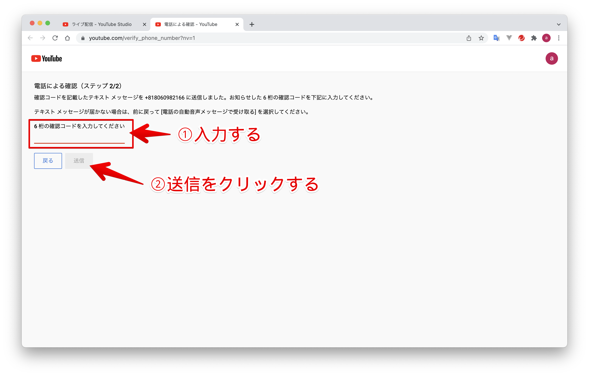

「電話番号を確認しました」が表示されたら、この画面を閉じます。

「ライブ配信」の画面に、ライブ配信用のアカウントが有効になるまで24時間かかる旨のメッセージが表示されるので、続きは24時間後に行います。
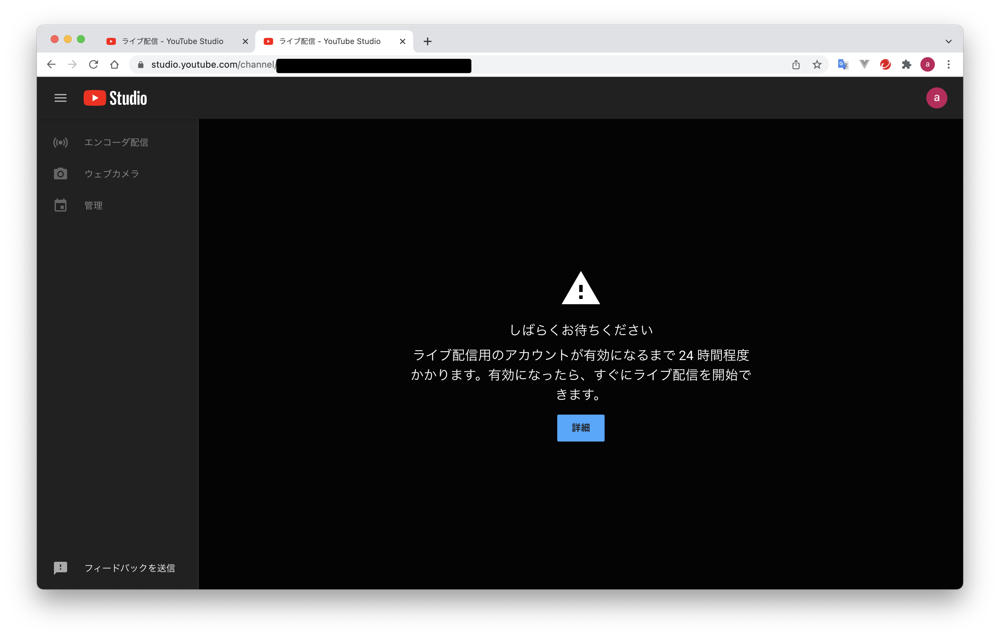

## ライブ配信をすぐに始める

PC内蔵カメラとマイクの内容をライブ配信する場合は、ブラウザからすぐに始められます。

### ライブ配信を始める

Youtubeのページから [自分の動画] - [コンテンツ] - [ライブ配信]の順にクリックし、「始める」をクリックします。

「Youtubeライブ管理画面にようこそ」と表示されるので、「今すぐ」枠の「開始」をクリックします。

「内蔵ウェブカメラ」枠の「選択」をクリックします。

「配信の作成」画面で配信の設定をします。  
設定は以下の3ステップです。

* 詳細
* カスタマイズ
* 公開設定

#### 詳細

「詳細」ステップでは、配信する内容に合わせて設定します。  
必須項目は「タイトル」と「視聴者」（子供向けかどうかを設定）なので、最低限これだけ入力すればOKです。  
お好みの設定にして、「次へ」をクリックします。

#### カスタマイズ

ライブ配信中のチャットの設定を行います。  
お好みの設定にして、「次へ」をクリックします。
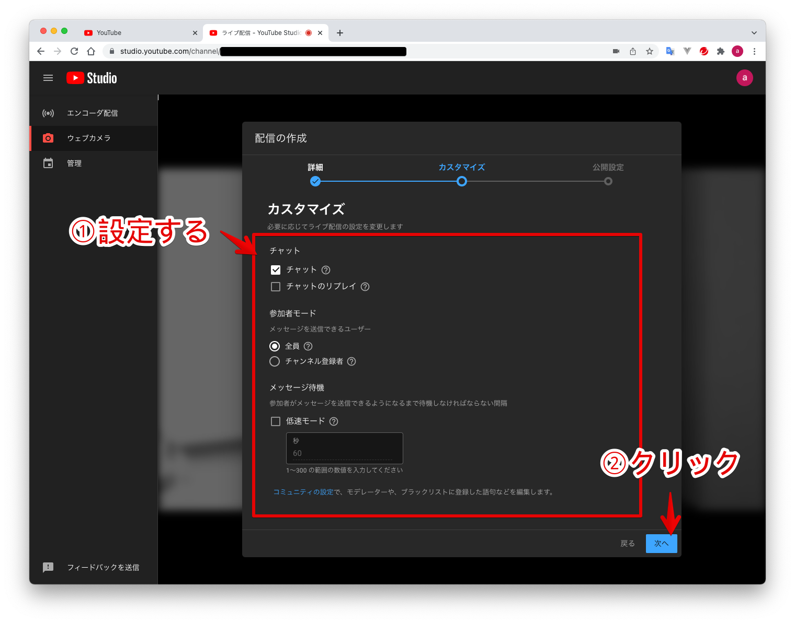

#### 公開設定

視聴できるユーザを指定します。  
限定公開は、ライブ配信のURLを知っているユーザのみ視聴できます。  
ライブ配信のURLは配信中にコピーすることができます。

今回は限定公開にします。限定公開を選択して「次へ」をクリックします。

「ストリームのプレビュー」画面が表示されます。
ライブ配信するカメラとマイクを選択します。  
「ライブ配信を開始」をクリックするとライブ配信が始まります。

ライブ配信が始まりました。

### ライブ配信中にライブ配信URLを取得する

ライブ配信画面の共有矢印アイコンをクリックすると、「ライブ配信の共有」画面が表示され、動画リンクのURLをコピーできます。
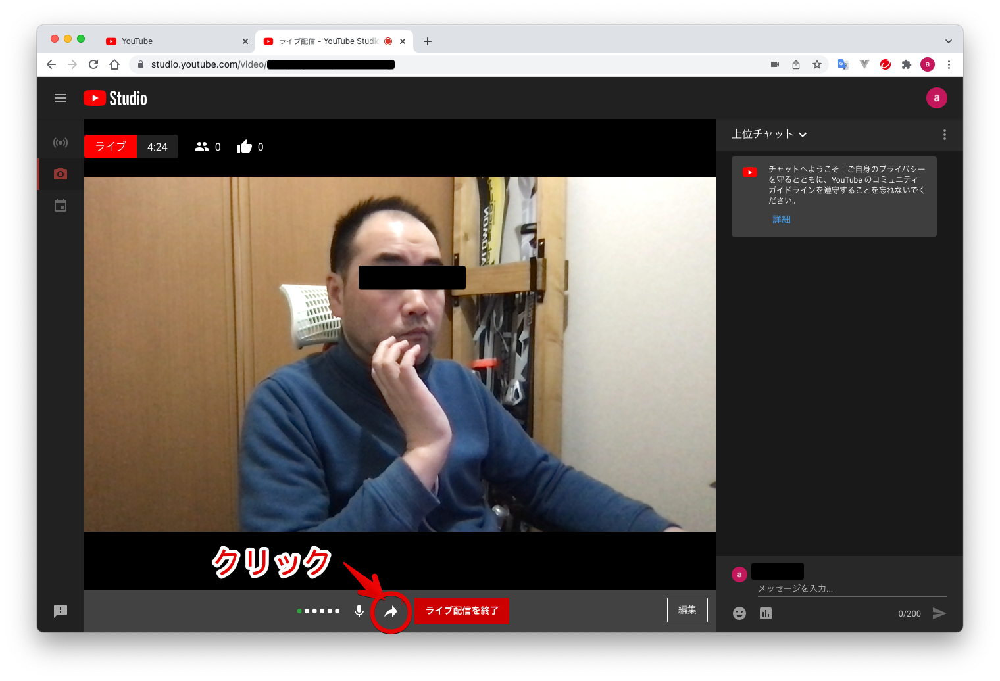

「動画リンク」に表示されているURLをライブ配信を見せたい人に共有します。

### ライブ配信を終了する。

「ライブ配信を終了」をクリックすると、ライブ配信を終了します。

「ストリーム完了」画面で「閉じる」をクリックします。

Youtube Studioの[コンテンツ]-[ライブ配信]をクリックすると、ライブ配信した動画が保存されています。  
ライブ配信した動画を再生したり、動画のURLを共有して他の人と動画を共有できます。

## ライブ配信を事前にスケジューリングする

事前に配信予定のライブ配信作成し、好きなタイミングでライブ配信を開始します。  

ライブ配信のURLを知っている人だけが視聴できる限定公開も可能です。  
配信予定を作成するとライブ配信URLをコピーできるので、事前に試聴してもよい人にURLを伝えるころができます。

### 配信予定のライブ配信を作成する

Youtube Studioを開き、[作成]-[ライブ配信を開始]をクリックします。

ブラウザを使ってノートPCのカメラとマイクの内容をライブ配信する場合は、左側のメニューで「ウェブカメラ」をクリックします。

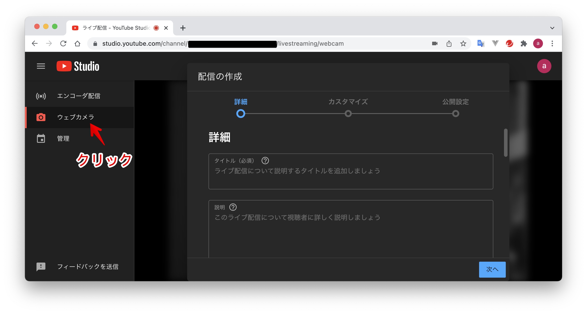

「配信の作成」画面で配信の設定をします。  
なお、設定内容は配信作成後でも編集することができます。

#### 詳細

入力必須項目の「タイトル」と「視聴者」を入力します。  
その他の項目は任意です。

入力したら「次へ」をクリックします。

#### カスタマイズ

ライブ配信中のチャットの設定を行います。  
お好みの設定にして、「次へ」をクリックします。

#### 公開設定

視聴できるユーザとスケジュールを指定します。  

今回はライブ配信URLを知っている人だけが視聴できるライブ配信にしますので、「限定公開」を選択します。

スケジュールにライブ配信を開始する日時を設定して、「次へ」ボタンをクリックします。

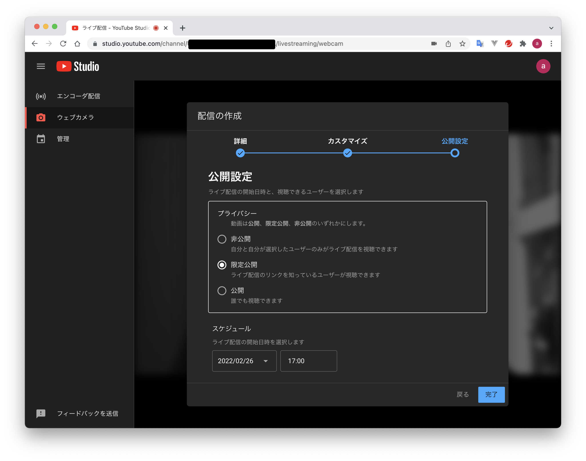

「ストリームのプレビュー」画面で内容を確認し、「完了」ボタンをクリックします。

これで配信予定のライブ配信を作成できました。

### 　配信予定のライブ配信を確認する

次の2つの方法で確認してみます。

- 自分のYoutube Studioで確認する。
- 視聴者にどう見えるか確認する。

#### Youtube Studioで確認する

Youtube Studioの[コンテンツ]-[ライブ配信]をクリックすると、「配信予定」にライブ配信の一覧が表示されます。

#### 視聴者にどう見えるか確認する

ライブ配信URLを受け取った視聴者にどう表示されるか確認します。

「配信予定」の一覧から確認したいライブ配信の行にマウスカーソルをあて、「オプション」をクリックします。

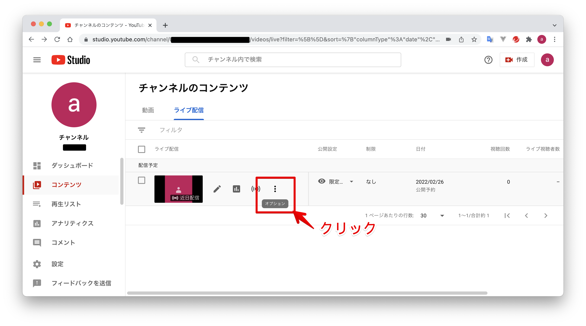

「共有可能なリンクを取得」をクリックすると、URLがクリップボードにコピーされます。

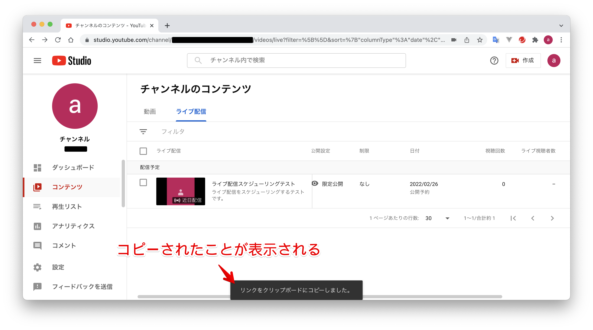

新しいブラウザ（もしくはブラウザの新しいタブ）を起動し、コピーしたURLを貼り付けてページを表示すると、視聴者側から見たライブ配信画面が表示されます。

### 配信予定のライブ配信を編集する

チャンネルの「コンテンツ」画面の「ライブ配信」タブに表示されている「配信予定」一覧で、編集したい行にマウスカーソルをあて、編集ボタンをクリックします。

「動画の詳細」画面で、ライブ配信の設定を編集できます。
左側のメニューの「詳細」「カスタマイズ」をクリックすると設定内容が表示されます。

編集がおわったら、画面右上の「保存」ボタンをクリックします。

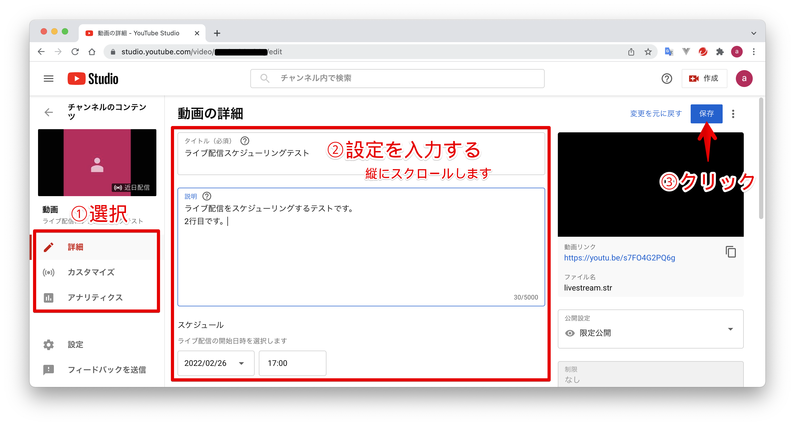

#### ライブ配信開始前に表示するサムネイルを変更する

ライブ配信開始前に訪れた視聴者に表示する画像を「サムネイル」といいます。

あらかじめ用意した画像ファイルをアップロードして設定できます。
  
> 今回のチュートリアルを作成するにあたって、サムネイル画像は [Canva](https://www.canva.com/ja_jp/)というデザインサイトで作成しました。 以下では、サムネイル用の画像ファイルが既に用意されている前提で説明します。

Youtube Studioの[コンテンツ]-[ライブ配信]をクリックします。  
「ライブ配信」タブに表示されている「配信予定」一覧から、編集したい行にマウスカーソルをあて、「編集」をクリックします。

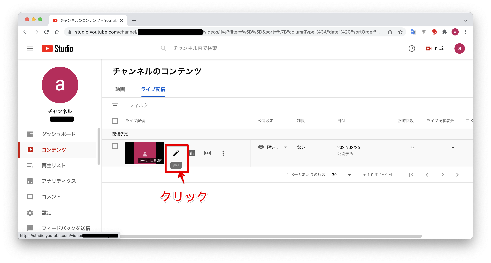

「動画の詳細」画面で「サムネイルをアップロード」をクリックします。

アップロードする画像を選択します。

サムネイル欄に選択した画像が表示されたら右上の「保存」をクリックします。

サムネイルが設定されました。

視聴者から見たライブ配信画面でのサムネイルを確認します。  
「動画リンク」をコピーしてブラウザのURL欄に貼り付けると、視聴者からみたライブ配信画面を確認できます。

### 視聴者にライブ配信URLを伝える

「限定公開」としたライブ配信はURLを知っている人だけが視聴できます。ライブ配信URLを取得する方法を説明します。

Youtube Studioを開き、[コンテンツ]-[ライブ配信]をクリックします。

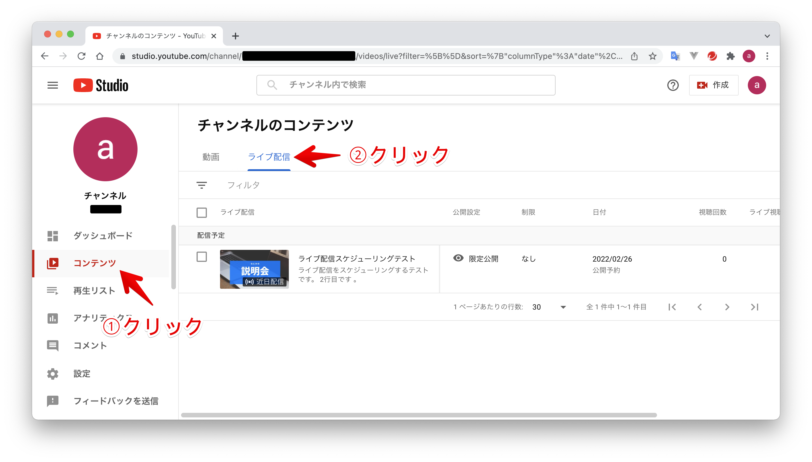

「配信予定」の一覧からURLを取得したいライブ配信の行にマウスカーソルをあて、「オプション」をクリックします。

「共有可能なリンクを取得」をクリックすると、URLがクリップボードにコピーされます。

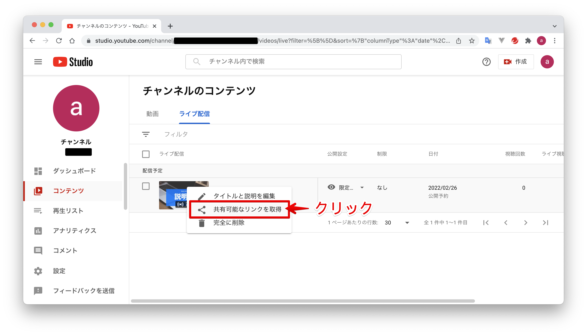

クリップボードにコピーされたURLをメールなどに貼り付けてライブ配信を視聴するユーザに通知します。

### 配信予定のライブ配信を開始する

Youtube Studioを開き、[コンテンツ]-[ライブ配信]をクリックします。

「配信予定」の一覧から開始したいライブ配信の行にマウスカーソルをあて、「ライブ管理画面で見る」をクリックします。

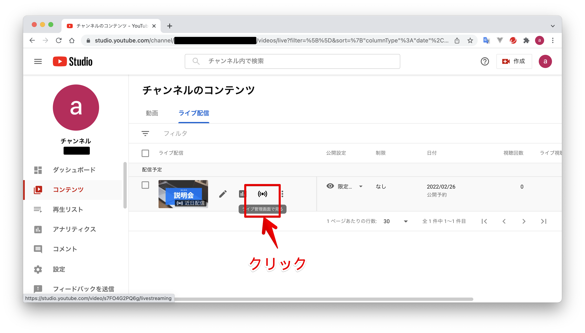

ライブ管理画面に移動して選択したライブ配信のストリームのプレビューが表示されます。

選択されているカメラ・マイクを確認し、ライブ配信で使用するカメラ・マイクになっているか確認します。

「ストリームのプレビュー」エリアの裏にカメラプレビューが映っているので、カメラの前で動いてみるとその動きを確認できます。

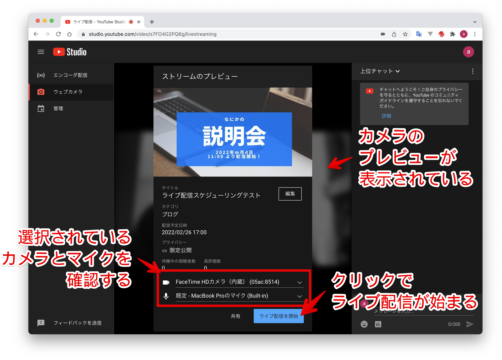

「ライブ配信を開始」ボタンをクリックすると、ライブ配信が開始します。

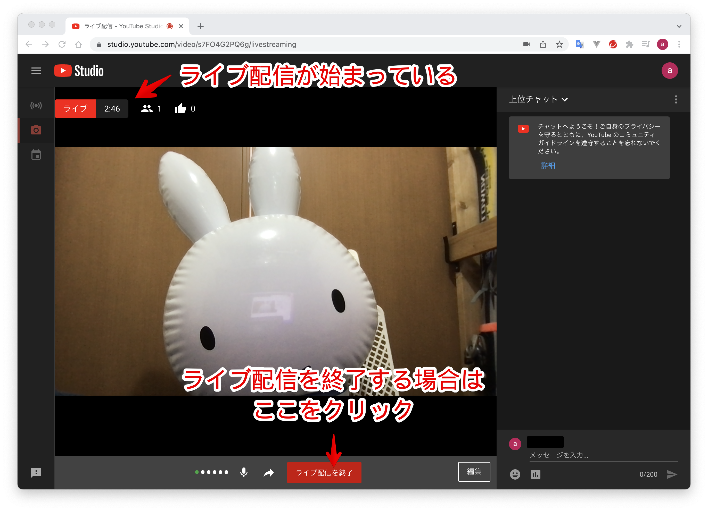

ライブ配信を終了する場合は、「ライブ配信を終了」をクリックしてください。
